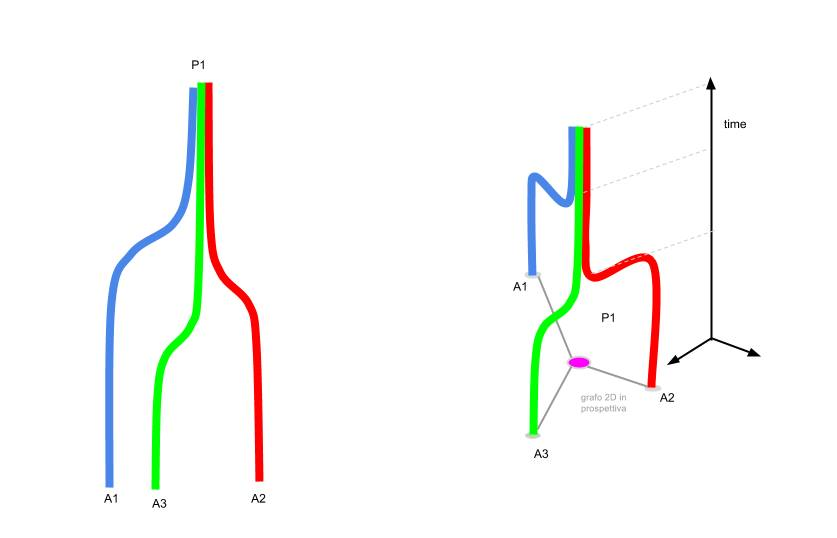
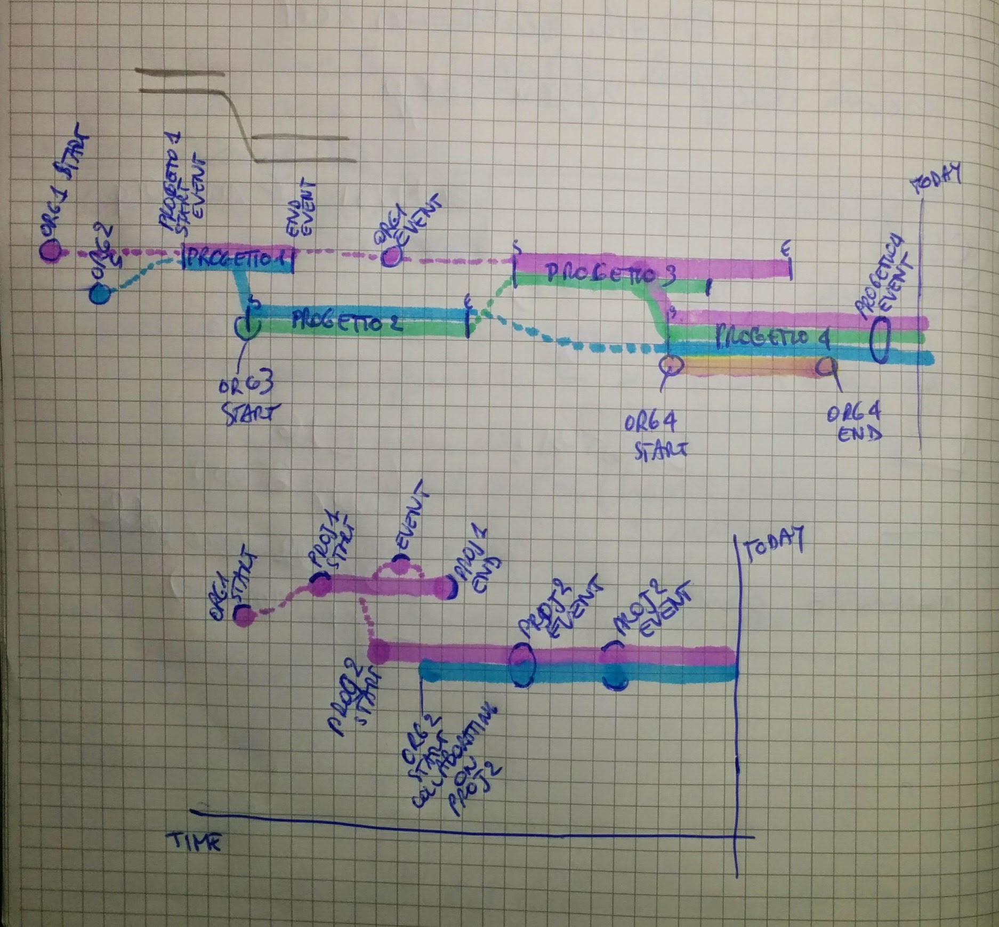

# Sketches

You can follow this idea in some mockup images:

* Organization line 

  
  
* Some organizations drawn together with project lines starting from intersections (projects lines are an entanglement of organization threads)  
  
  , , , , 

* Project ego-meshwork
  
  .

* Lines details
  
  , , .

* Christian Lovato's projection. 

  Christian suggests that the meshwork display is just onother projection of a 3D graph; while the network display is a top view, the meshwork is a side view. Here is his picture:
  
  .
  
* Storyline visualizations
  We have already coded our meshwork visualization, leveraging the force-layout algorithm, and I'm quite content with it. But recently I discovered that so much was already done bu computer scientists. So I would like to build on this work, in the future, and I start here with a new sketch drawn after reading some papers.
  .
  
  Papers: 
  * Ogawa, Michael, and Kwan-Liu Ma. 2010. “Software Evolution Storylines.” In Proceedings of the 5th International Symposium on Software Visualization - SOFTVIS ’10, 35. New York, New York, USA: ACM Press. doi:10.1145/1879211.1879219.
  * Tanahashi, Y, and KL Ma. 2012. “Design Considerations for Optimizing Storyline Visualizations.” IEEE Transactions on Visualization and Computer Graphics 18 (12): 2679–2688.
  * Liu, S, Y Wu, E Wei, M Liu, and Y Liu. 2013. “Storyflow: Tracking the Evolution of Stories.” IEEE Transactions on Visualization and Computer Graphics 19 (12): 2436–2445.

Go back to [README.md](README.md)
